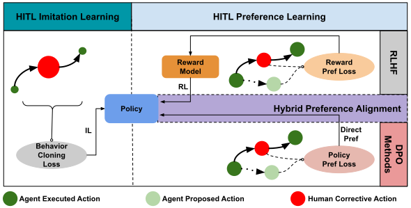
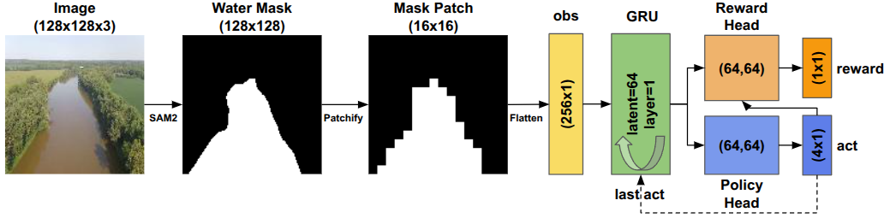
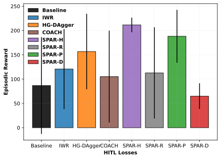
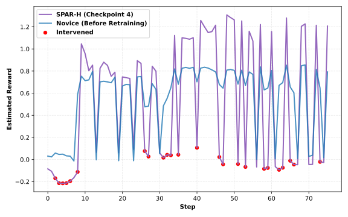
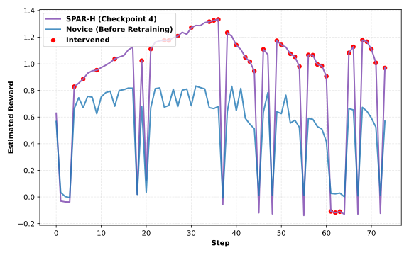
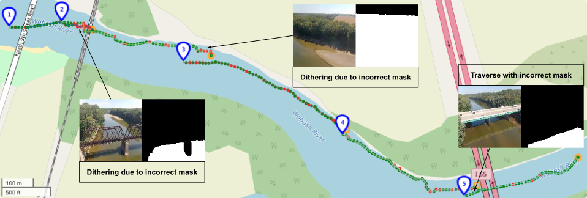
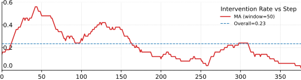

# Statewise Hybrid Preference Alignment for Robotics (SPAR-H)




## Overview
Statewise hybrid preference alignment (SPAR-H) combines direct (RL-free) preference optimization applied to policy logits and RLHF-style reward model preferences that indirectly drive policy update.
Both signals arise from per-state comparisons between the human override and the agent proposal.
Imitation learning methods mainly use weighted behavior cloning on the human-intervened trajectory, where human corrective actions are given larger weights.


## Key Contributions
* A unified HITL framework that turns statewise human corrections into both direct policy updates and reward-based RL targets in a single model.
* A controlled evaluation on vision-driven river following with human interventions, comparing direct statewise preference, RLHF, IL, and evaluative RL methods under a fixed feedback budget.
* A real-world deployment of our HITL preference learning stack on a UAV river following task, demonstrating rapid online adaptation from sparse corrections and declining interventions under imperfect perception.


## Video Introduction
https://github.com/user-attachments/assets/5c140fda-e5aa-4dad-8cb0-fe042adaabe1


## Image-to-action Pipeline

RGB is segmented by SAM2 into a water mask, patchified, passed through a frozen GRU encoder, then split to a policy head (action) and a reward head (immediate reward).


## Results - Simulation


Final checkpoint performance. SPAR-H achieves the highest mean reward and lowest variance across initial conditions.



Reward estimates of Cp4 (final checkpoint) on Ep0 for $a^\text{a}$. SPAR-H elevates human-approved actions and nearby choices while suppressing rejected ones.



Reward estimates of Cp4 on Ep4 for $a^\text{e}$. Human-approved actions form peaks, showing stable alignment over multiple updates.


## Real-world Deployment



Five HITL trajectories during deployment with SPAR-H.
Green dots: executed agent-proposed actions.
Red dots: human overrides.
Orange dots: trajectory ends.
Bottom: moving averaged intervention rate per 50 steps.
Interventions taper across sorties as the policy adapts online.


If you find our work useful in your research, please cite our paper:
```
@article{wang2025deployable,
  title={Deployable Vision-driven UAV River Navigation via Human-in-the-loop Preference Alignment},
  author={Wang, Zihan and Li, Jianwen and Wu, Li-Fan and Mahmoudian, Nina},
  journal={arXiv preprint arXiv:2511.01083},
  year={2025}
}
```

