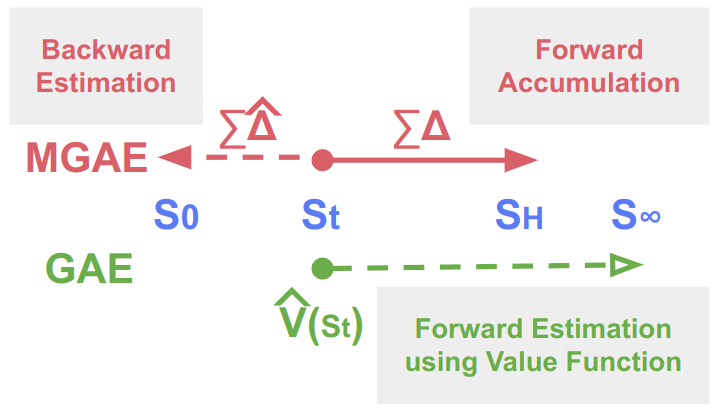
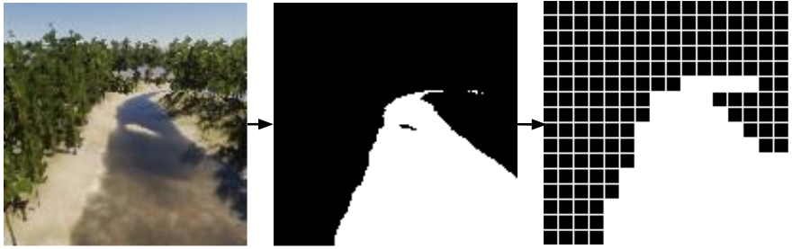
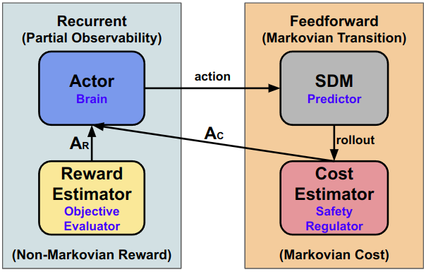
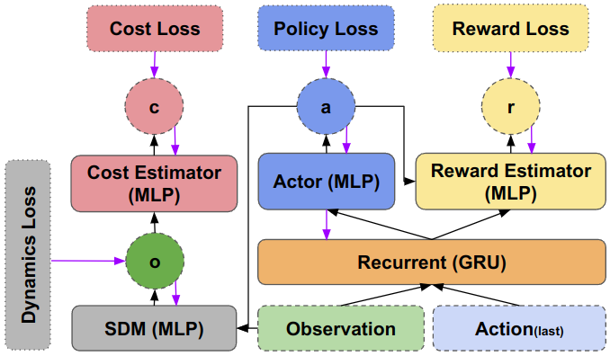

# CADE: Constrained Actor Dynamics Estimator for Model-based Safe Reinforcement Learning


## Overview
CADE is a **Model-based Safe Reinforcement Learning (SafeRL)** framework designed to address vision-driven autonomous river following in challenging environments where GPS signals are unreliable.
This repository implements the **Marginal Gain Advantage Estimation (MGAE)** method, the **Semantic Dynamics Model (SDM)** for interpretable state prediction, and the **CADE** architecture, which integrates safety-aware model-based RL to solve **partially observable Constrained Submodular Markov Decision Processes (PO-CSMDPs)**.
Such environments include [CliffCircular-v1](https://github.com/EdisonPricehan/CliffCircular) and [Safe Riverine Environment](https://github.com/EdisonPricehan/ml-agents-river), which can both be installed via PyPI packages ([cliffcircular](https://pypi.org/project/cliffcircular/), [safe-riverine-envs](https://pypi.org/project/safe-riverine-envs/)).
The whole repo is developed on top of [OmniSafe](https://github.com/PKU-Alignment/omnisafe). Thanks to their contributions to SafeRL.

## Key Contributions

- **MGAE**

MGAE is designed to handle non-Markovian rewards in SMDPs, where future rewards depend on historical trajectory rather than just the current state.
Unlike GAE, which bootstraps future rewards using a value critic, MGAE looks backward by leveraging a recurrent reward estimator to approximate immediate rewards.
This avoids bias from value function errors and ensures advantage estimation aligns with the cumulative nature of submodular rewards.
By focusing on marginal historical gains rather than future predictions (state value), MGAE provides a more stable and accurate policy update in environments where rewards depend on past exploration.



- **SDM**

Instead of learning vision dynamics in latent space, SDM estimates the homography transformation between consecutive semantic observations.
The semantic observation in Safe Riverine Environment is the patchified water mask from drone view.



The comparison of SDM with other vision dynamics models (e.g., Lagent Dynamics Model) is graphically shown below.


https://github.com/user-attachments/assets/7adbf89f-f6d9-44dd-98c3-eddb12354a35


- CADE

CADE is built on top of the policy gradient method First Order Constrained Optimization in Policy Space ([FOCOPS](https://proceedings.neurips.cc/paper_files/paper/2020/hash/af5d5ef24881f3c3049a7b9bfe74d58b-Abstract.html)), which uses the Lagrangian multiplier to balance reward advantage and cost advantage in policy update, and integrates the KL divergence loss in the same policy loss.
But the differences are:
1. The actor and reward estimator share the same recurrent network (GRU).
2. No critics, just a reward estimator and a cost estimator that estimates the immediate reward and immediate cost.
3. The reward advantage is calculated by MGAE.
4. The cost advantage is defined as the discounted cumulative sum of predicted costs (by SDM and actor) in a short horizon, then transformed by sigmoid function.
5. The training goes episode by episode, instead of batch by batch.
6. Safety can also be injected during inference phase by the **safety layer with cost planning**, which also uses SDM and actor for planning.

The diagram of CADE's 4 components is shown below.



The computational graph of CADE shows the forward pass and backpropagation pass, and the inputs and outputs of all components.




## Major Components
The code of CADE is built on the original infrastructure of OmniSafe, but tries to separate components from existing SafeRL algorithms for easier maintenance, debugging and comparison.
The core files of CADE are listed below.

### CMDP Environment Wrapper
- [DiscreteEnv](omnisafe/envs/discrete_env.py): CMDP environment wrapper of CliffCircular-v1 that supports discrete action space.
- [RiverineEnv](omnisafe/envs/riverine_env.py): CMDP environment wrapper of Safe Riverine Environment that supports post-processing of RGB+water mask observation.

### Algorithm
CADE, based on FOCOPS, is also an on-policy first order method. The training procedure of CADE is in [focops_cade.py](omnisafe/algorithms/on_policy/first_order/focops_cade.py).

### Network Architecture
The network architecture of CADE is defined in [constraint_actor_dynamics_estimator.py](omnisafe/models/actor_critic/constraint_actor_dynamics_estimator.py), which also contains the safety layer planning methods.
Since the actor in CADE receives the latent unit from a recurrent network as input, we define the [latent_categorical_actor.py](omnisafe/models/actor/latent_categorical_actor.py) for actor with discrete action space, and [latent_multi_categorical_actor.py](omnisafe/models/actor/latent_multi_categorical_actor.py) for agent with multi-discrete action space.
For the same reason, the reward estimator in CADE is defined in [r_critic.py](omnisafe/models/critic/r_critic.py), which we did not remove "critic" for now.

### Buffer
CADE uses on-policy buffer [onpolicy_cade_buffer.py](omnisafe/common/buffer/onpolicy_cade_buffer.py), but stores complete episodes (original implementation might truncate the last unfinished episode when max buffer size is reached). It also defines the MGAE and the cost advantage.
The standardization of reward advantage and cost advantage is defined in [vector_onpolicy_cade_buffer.py](omnisafe/common/buffer/vector_onpolicy_cade_buffer.py).

### Vision Dynamics Model
All vision dynamics models are defined in the [dynamics](omnisafe/models/dynamics) folder, including the proposed [SDM](omnisafe/models/dynamics/sdm.py), and other comparative models like [SDM-MLP](omnisafe/models/dynamics/sdm_mlp.py), [LDM](omnisafe/models/dynamics/ldm.py) and [LDM-MLP](omnisafe/models/dynamics/ldm_mlp.py).
The dataset used to train and evaluate different models in SRE is in [riverine](omnisafe/datasets/riverine).
The pre-trained VAE model for 4-channel (RGB+mask) image encoding used as input by latent dynamics models is [vae-4channel.pth](omnisafe/models/dynamics/vae-4channel.pth).
The source code of VAE is in our another repo [Synergistic Reinforcement and Imitation Learning](https://github.com/lijianwen1997/Synergistic-Reinforcement-and-Imitation-Learning/tree/main/encoder).
Note that SDM only uses the water mask. The patchfication method is implemented in [patchification.py](omnisafe/utils/patchification.py).

### Episode Dataset
The [episode_dataset.py](omnisafe/utils/episode_dataset.py) splits data by episodes with padding for episode-by-episode training of CADE.


## Installation

A virtual python environment (e.g., miniconda) is recommended to create before installing dependencies of OmniSafe and CADE.

```bash
git clone git@github.com:EdisonPricehan/omnisafe-cade.git
cd omnisafe-cade
git checkout cacd
pip install -e .
```


## Usage
All hyperparameters of CADE for both environments are stored in [FOCOPS_CADE.yaml](omnisafe/configs/on-policy/FOCOPS_CADE.yaml).
Make sure you have installed the two environments per respective guide.

To train CliffCircular-v1 environment, run
```bash
python examples/train_cliffcircular.py
```

To train SRE, run
```bash
python examples/train_riverine.py
```

wandb and tensorboard logging are enabled by default in the yaml file.

To evaluate the trained CADE, modify the variables in [eval_cade.py](examples/eval_cade.py)
```python
env_id: str = 'medium'  # or CliffCircular-v1
save_path: str = 'evaluations/cliffcircular' if 'CliffCircular' in env_id else 'evaluations/riverine'
model_name: str = 'epoch-1500.pt' if 'CliffCircular' in env_id else 'epoch-350.pt'
eval_episodes: int = 30  # Evaluation episodes number
difficulty: int = 0  # [0, 2], different difficulty levels of env
evaluate: bool = False  # Eval if True, read csv data and get stat if False
safety_layer_enabled: bool = True  # Whether enable cost-planning safety layer in evaluation
merge_across_envs: bool = True  # Get stats across all difficulty levels
```
then run
```bash
python examples/eval_cade.py
```

